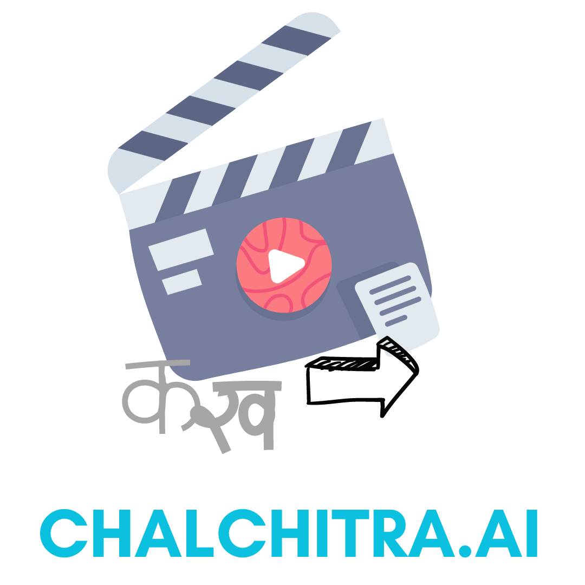

# chalchitra.ai
Transform your text into captivating, lipsynced animated videos effortlessly, with multilingual support including a wide range of Indian languages.

## Demo
https://github.com/pranav2305/chalchitra.ai/assets/76661350/b4e278c8-4e91-4220-82d2-b84cb6d267b5

## Examples
https://github.com/pranav2305/chalchitra.ai/assets/79962251/4702dac0-afc6-40cd-9ca4-0fe584d308ed

https://github.com/pranav2305/chalchitra.ai/assets/79962251/c2df5a23-91ea-44bb-903e-d3017dab472a

## Table of content
1. [Project Idea](#project-idea)
2. [Our Approach](our-approach)
3. [Challenges We Faced](#challenges-we-faced)
4. [Technologies We Used](#technologies-we-used)
5. [Network Diagram](#network-diagram)
6. [Installation and Setup Guide](#installation-and-setup-guide)
7. [Team Members](#team-members)

## Project Idea

Animated videos are loved by almost everyone but the time and expertise required to make them is quite high. Chalchitra.ai was born out of the need to bridge the gap between text-based content and engaging videos. We recognized the demand for synchronized lip-synced animated videos with multilingual support, particularly in Indian languages, empowering content creators, educators, and businesses to convey their messages effectively and captivate their audiences.

### Features

1. Transform your text into captivating short animated videos effortlessly. Chalchitra.ai brings your words to life with vibrant visuals and synchronized lip movements.

2. Chalchitra.ai goes beyond language barriers. It offers extensive multilingual support, including a diverse range of Indian languages. 

Be at an ad film, a storyboard, a short reel or a quick video for your product, Chalchitra.ai has got you covered

### Use Cases

1. Digital Advertising: Generate attention-grabbing animated ads with vibrant visuals effectively conveying your marketing message to the target audience, in a fraction of a time.

2. E-Learning and Education: Enhance the learning experience with visually appealing animated videos that explain complex topics, aided by multilingual support.

3. Language Learning: Aid language learners by creating animated videos demonstrating correct pronunciation, lip movements, and contextual usage of words and phrases in different languages.

4. Entertainment and Media: Produce animated videos for entertainment purposes, such as funny skits, comedic dialogues, or animated web series.

5. News and Information Sharing: Present news updates, information, or public announcements in visually appealing animated videos, grabbing attention and making information easily digestible.

6. Personalized Greetings and Invitations: Add a personal touch to greetings, invitations, or special messages by transforming them into animated videos, delivering heartfelt messages.

## Our Approach

**Text Manipulation with GPT-3.5 Turbo**: When a user submits their text and preferred language, the text is transformed into a script and returned in the JSON format with several attributes.

**Image Generation using Stable Diffusion**: With the structured JSON, the relevant details are inputted into the stable diffusion model. The prompts are manipulated to ensure that the generated images align seamlessly with the intended narrative and artistic style.

**Speech Translation using Google Cloud Translation API**: The character's dialogues are translated into the language selected by the user.

**Audio generation using Google Cloud Text to Speech API**: The audio dialogues of the character are created in the specified language using the Wavenet model, taking into consideration the character's gender and region.

**Lip syncing using SadTalker**: Stylized audio-driven single image talking face animation is achieved using SadTalker by supplying an image and the corresponding dialogue audio.

**Stitching all the generated videos**: All the generated videos are combined into a single mp4 file using FFMPEG.

## Challenges We Faced

- Finding appropriate pre-trained models for our use cases
- Getting the SadTalker model up and running on our local system
- Stitching all the videos together

## Technologies We Used

- OpenAI's ChatGPT
- Stable Diffusion
- Wavenet (Google Cloud Text to Speech API)
- Google Cloud Translation API
- SadTalker
- Flask
- Next.js
- FastAPI
- FFMPEG

## Network Diagram

## Installation and Setup Guide
To get started with Comicify.ai, follow these steps:
1. Clone the repo:  
`git clone https://github.com/pranav2305/chalchitra.ai.git`
2. Go to project directory  
`cd chalchitra.ai`

### Using the Next.js Frontend
1. Change directory to client  
`cd client`
2. Install npm packages  
`npm i`
3. Run the dev server  
`npm run dev`

### Using the Flask Backend
1. Change directory to server  
`cd server`
2. Create a .env file from .env.example
`cp .env.example .env`.
3. Update the API keys in .env:  
  a. `OPEN_AI_API = '<your-api-key>'`. Follow these instructions to obtain your key from OpenAI.  
  b. `STABLE_DIFFUSION_API = '<your-api-key>'`. Follow these instructions to obtain your key from Dream Studio.  
4. Create a virtual environment and activate it.  
`python -m venv env`
5. Install the requirements  
`python -r requirement.txt`
6. Get your Google Applications Credentials json file and activate it  
`export GOOGLE_APPLICATION_CREDENTIALS=<path_to_json_file>`
8. Run the flask server  
`flask --app main run`

### Using the SadTalker Model
Refer the [SadTalker README.md](https://github.com/pranav2305/chalchitra.ai/blob/main/server/models/SadTalker/README.md) for setup instructions

## Team Members

[Abhiraj Mengade](https://www.linkedin.com/in/abhiraj-mengade/)

[Parth Mittal](https://www.linkedin.com/in/mittal-parth)

[Pranav Agarwal](https://www.linkedin.com/in/ag-pranav)
